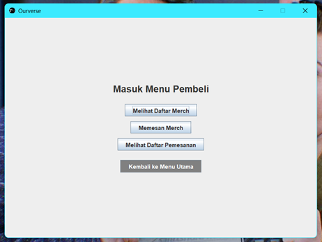

<<<<<<< HEAD
# ourverse_pbo

**1. Pendahuluan :**
Ourverse ialah sebuah aplikasi _e-commerce_ yang dirancang khusus untuk mencari _merchandise_ grup Korean Pop bernama Seventeen. Di dalam Ourverse, pengguna dapat melakukan pembelian _merchandise_ secara _daring_ melalui satu pusat administrasi. Ourverse menjadi aplikasi berbasis resmi yang siap memenuhi permintaan para kolektor serta dapat merangkul beberapa admin _merchandise_ untuk bekerja sama memperluas pemasaran.

**2. Aktor-Aktor yang Terlibat :**
Ourverse melibatkan dua aktor utama dalam aplikasi, yaitu pegawai serta pembeli. Pegawai mempunyai akses yang setara dengan admin dan programmer, di mana pegawai dapat mengelola laman pegawai dan pembeli. Selain itu, pegawai juga mempunyai hak untuk mengatur penambahan maupun pengurangan _merchandise_. Aktor pembeli hanya dapat mengakses laman pembeli, yang bisa melihat daftar _merchandise_ serta dapat mengisi formulir pembelian.  

**3. Framework GUI : **
Java Swing, dijalankan melalui Visual Studio Code

**4. Tampilan _Frame_ :**
Di bawah ini akan dipaparkan secara rinci tentang tampilan _window_ dari seluruh halaman. 

**a. _Frame_ Masuk**
_Frame_ utama akan tampak seperti berikut. Terdapat dua tombol navigasi yang berbeda karena kedua aktor akan masuk ke dalam _frame_ tersendiri.
   
   

Terkhusus pegawai, ia memerlukan _login_ terlebih dahulu dengan kata sandi yang sudah ditentukan oleh sistem, dengan maksud membatasi akses orang lain yang tidak berkepentingan pada sistem Ourverse.

   

**b. Tampilan Menu utama**
Tampilan menu utama pada kedua aktor akan berbeda. Aktor pegawai dapat menambahkan daftar _merchandise_, melakukan perubahan stok _merchandise_, melihat daftar _merchandise_ yang terpublikasi di laman pembeli, serta melihat daftar pesanan _merchandise_ pembeli yang harus segera diproses pengirimannya.

   

Tampilan menu utama aktor pembeli terdapat tiga tombol, yaitu melihat daftar _merchandise_ yang bersifat _up to date_ apabila terdapat _input_ baru dari admin, memesan _merchandise_, dan melihat daftar pemesanan.

   

**c. _Frame_ Pegawai/Admin**
_Frame_ pegawai akan tampak seperti tangkapan layar di bawah ini. Pegawai dapat melakukan penambahan _merchandise_ pada daftar yang sudah ada. Pegawai dapat mengatur kode _merch_, nama, harga, dan stok _merch_ dan kemudian disimpan di dalam sistem. _Merchandise_ yang ditambahkan akan otomatis tercatat di daftar _merch_.

   

Kemudian apabila terdapat perubahan stok _merchandise_, pegawai dapat melakukan edit di fitur menambahkan stok _merch_. Di sini pengguna bisa terlebih dahulu memilih kode _merch_, kemudian mengubah kuantitas stok dengan tipe input harus berupa angka. 

   

Otomatis perubahan yang dilakukan pegawai akan mempengaruhi daftar _merchandise_.

Pegawai juga mempunyai kebebasan untuk melihat riwayat pemesanan yanng dilakukan oleh pembeli. Tidak hanya sampai di situ, bila terjadi ketidaksesusaian data, pegawai dapat menghapus pesanan pembeli dengan cara memasukkan kode _merchandise_ yang mau dihapus. 

**d. _Frame_ Pembeli**
_Frame_ pembeli akan tampak seperti tangkapan layar di bawah ini. Pembeli dapat melihat daftar _merchandise_, memesan _merchandise_, dan melihat daftar pemesanan yang sudah diisi oleh pembeli. Pada fitur melihat daftar _merch_, pembeli dapat meninjau daftar _merchandise_ yang akan dibeli nanti.

Lalu pada fitur pemesanan _merchandise_, pembeli bisa mengisi formulir pemesanan dengan memasukkan nama, alamat, daftar _merchandise_, jumlah barang yang dipesan, serta memasukkan metode pembayaran. Nantinya sistem akan mengirimkan notifikasi tanda formulir berhasil diterima oleh sistem. Tetapi jika tidak, sistem akan mengirimkan pesan error.

Pada riwayat pemesanan, pembeli dapat meninjau kembali riwayat pembeliannya dan mempunyai hak untuk menghapus pesanan. caranya serupa dengan yang pihak pegawai lakukan, di mana pembeli perlu memasukkan kode _merchandise_ dan kemudian menghapus pesanan tersenbut secara permanen.

